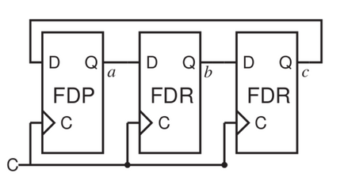
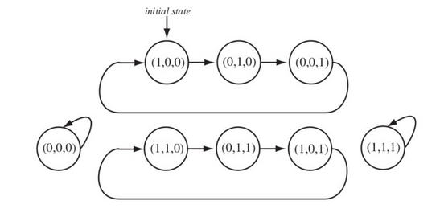
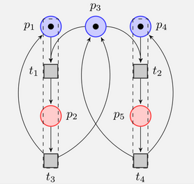

# complyer

A symbolic model checker for verifying safety and temporal specifications.


## Dependencies

- [Verification Algorithms](https://github.com/AnandSaminathan/verification-algorithms)
- [Formula Tree](https://github.com/AnandSaminathan/formula-tree)
- [Z3](https://github.com/Z3Prover/z3)

## Docker usage

To verify a model and specification present in `file.smv`:

```
docker run -it --rm -v `pwd`/file.smv:/f anandsaminathan/complyer f [options]
```

## Build Instructions

```
git clone https://github.com/AnandSaminathan/complyer
cd complyer
sudo apt-get install build-essential cmake
sudo apt-get install pkg-config uuid-dev
sudo apt-get install antlr4
export LD_LIBRARY_PATH=`pwd`/build/formulatree/src/git_formulatree/bin
mkdir build; cd build
cmake ../
make
```

## Usage

After building, the tool can be run using:

```
./complyer [-i] [-v] [-b <command-file>] <file-name>
```
#### Options
- ```-i, --interactive```  : Enable Interaction (use `help` command to get a list of all available commands)
- ```-v, --verbose```      : Descriptive Logs
- ```-b, --batch```        : Batch process commands

**Note:** Interactive and Batch cannot be enabled simultaneously

## Examples

The model checker is based on the smv language which captures the Kripke structure of a model (initial states and transitions). 

A simple [finite state machine](https://en.wikipedia.org/wiki/Finite-state_machine) in smv language:

#### Three-bit ring counter



The above figure shows a circuit for a 3-bit ring counter which has the property that only one bit is high at any given moment. The following is the state transition diagram for the above circuit:



**Note**: Image's taken from [here](https://www.di.ens.fr/~pouzet/cours/mpri/bib/sheeran-FMCAD00.pdf).

At the inital state only the first flip-flop is set to 1 and the others are 0. On each successive clock pulse, every flip-flop takes the value of it's predecessor in a cyclic fashion. 

This model of the ring counter can be represented using the smv language as follows:

```
-- three bit ring counter

MODULE main

-- 3 boolean variables, one for each bit

VAR a : boolean;
VAR b : boolean;
VAR c : boolean;

ASSIGN

-- initial state is (1, 0, 0)

init(a) := true;
init(b) := false;
init(c) := false;

next(a) := c;
next(b) := a;
next(c) := b;

-- safety specification - oneHigh property

SAFETYSPEC
((a && !b && !c) || (!a && b && !c) || (!a && !b && c))

```
The above snippet declares three `boolean` variables `a, b, c` (one for each flip-flop/bit), the initial values of the flip-flop's are assigned using `init` (only the first has the value `true`). 
The transitions of each flip-flops are assigned using `next`, for example, flip-flop `a` takes the value of flip-flop `c`. 
Only one of the flip-flops can have the value `true` at any state (safety property), this is same as saying: `((a && !b && !c) || (!a && b && !c) || (!a && !b && c))`. When this formula is given under `SAFETYSPEC`, the model checker verifies if the given model satisfies the property or not and provides some traces/paths in case the property is not satisfied. 


A simple extension of the above language can also be used to represent [petri-nets](https://en.wikipedia.org/wiki/Petri_net):

#### Mutex

Mutual exclusion is a standard property of concurrency control. A simple mutex solution for two threads is as follows:




The left half of the above petri-net can be considered as thread *A* and right half can be considered as thread *B*.
`p1` and `p4` are the non-critical sections of thread *A* and *B* respectively. `p2` and `p5` are the critical sections of thread *A* and *B*.
`p3` represents the lock, any thread which needs access to it's critical section needs to obtain the lock. 
As there is only one token in `p3`, only at most one of `t1` or `t2` can fire at any point in time. This ensures that both *A* and *B* doesn't access their respective critical sections at the same time.

The above model can be represented in smv as follows:
```
-- mutual exclusion

MODULE main

-- five places in the petri net of a 2 thread system 

VAR p1 : integer;
VAR p2 : integer;
VAR p3 : integer;
VAR p4 : integer;
VAR p5 : integer;

ASSIGN

-- initial tokens

init(p1) := 1;
init(p2) := 0;
init(p3) := 1;
init(p4) := 1;
init(p5) := 0;

-- t1 - token acquisition by thread 1
next({p1, p2, p3}) := (p1 >= 1 && p3 >= 1) [t1]: {p1 - 1, p2 + 1, p3 - 1};
-- t2 - token return by thread 1
next({p1, p2, p3}) := (p2 >= 1) [t2]: {p1 + 1, p2 - 1, p3 + 1};
-- t3 - token acquisition by thread 2
next({p3, p4, p5}) := (p3 >= 1 && p4 >= 1) [t3]: {p3 - 1, p4 - 1, p5 + 1};
-- t4 - token return by thread 2
next({p3, p4, p5}) := (p5 >= 1) [t4]: {p3 + 1, p4 + 1, p5 - 1};

-- safety specification for mutex

SAFETYSPEC
!(p2 > 0 && p5 > 0)
```

The above snippet declares five integer variables (one for each place). Initially only `p1`, `p3` and `p4` has a token, this is specified using `init`. 
When a transition fires, all the places change concurrently (unlike state machines). This can be specified using concurrent next `next({p1, p2, ..., pn})` where `p1, p2..., pn` are the places related to a transition. Example: Transition `t1` can fire only if both `p1` and `p3` has a token, this is same as the formula `p1 >= 1 && p3 >= 1`. If `t1` fires then one token is removed from `p1` and `p3`,  one is added to `p2`, this is specified using `{p1 - 1, p2 + 1, p3 - 1}`. 
The safety specification in case of this problem is `!(p2 > 0 && p5 > 0)` because if both threads *A* and *B* are in their critical sections then both `p2` and `p5` will have a token, so not of that should hold.

More example snippets can be found under `examples/`.
